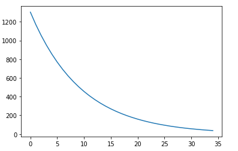

# Cat vs no cat Image classification
Implemented Neural Network from the scratch
## Dataset
Small dataset collected from Kaggle Link - https://www.kaggle.com/mriganksingh/cat-images-dataset
## Workflow
* ### Structure of Neural Network chosen
	* 10 hidden layer with 30 unit in it, 1 input layer and 1 output layer architecture is selected (gives good result, can be tweak).
	* Each hidden layer is implemented by using Leaky ReLU function and output layer is implemented using sigmoid activation function.
* ### Functions Implementd
	* initialization - function takes input layer dimmensions and output the random generated initials parameters.
	* activation - takes input values and kind, it applies the activation function on values of type kind and return activation value and derivatives.
	* forward - implemented forward propogation here.
	* cost - calculates the cost using the passed parameters.
	* backward - implemented back propogation.
	* update_parameters - update the parameters using gradients and returns the updated parameters.
	* neural_network_model - uses other functions in sequence in order to learn and returns the final trained parameters.
	* predict - function calculates the confusion matrix and print the accuracy.
* ### Learning Plot
	* plot of cost function on y axis vs number of iterations on x axis
	* 
* ### Results
	* #### Training results - 0.995
	* #### Test Results - 0.84

Neural Network is implemented in general and transparent way so that it can be reuse with very few changes.
